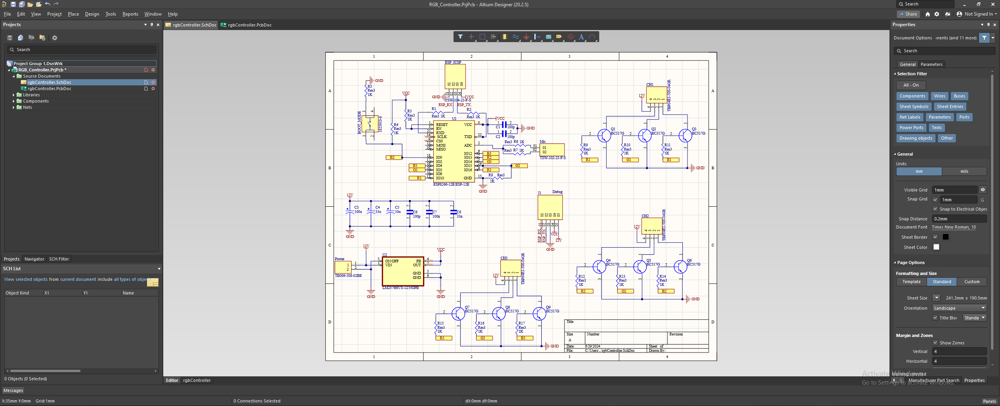
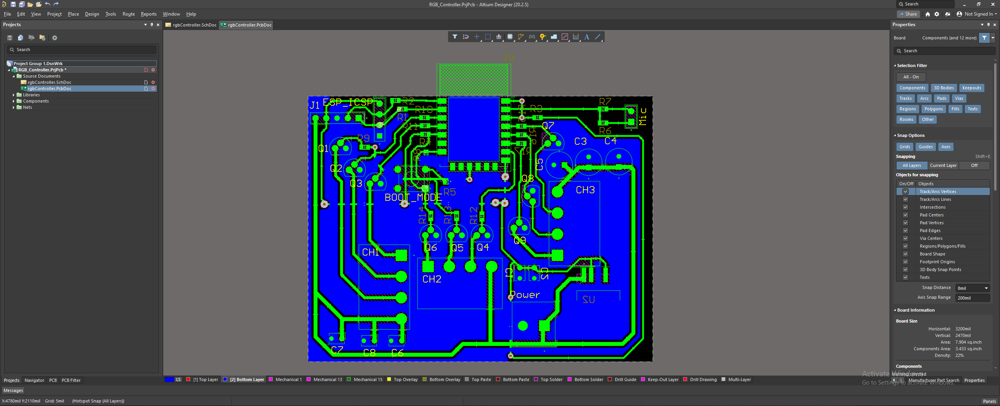
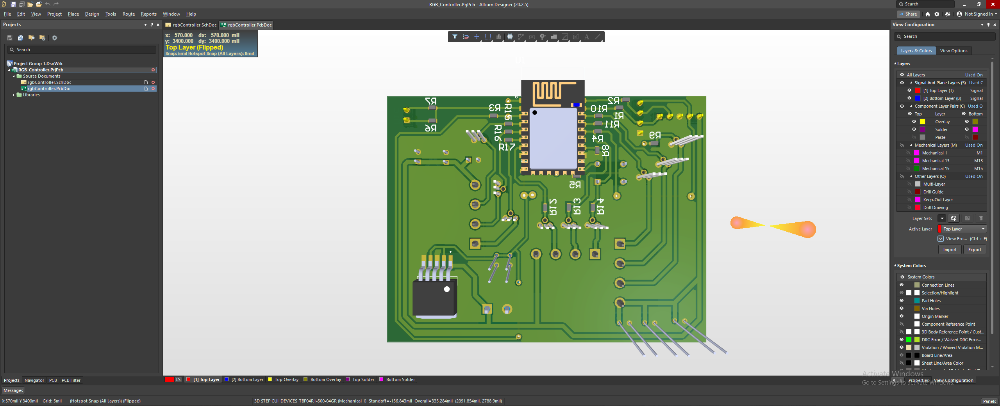
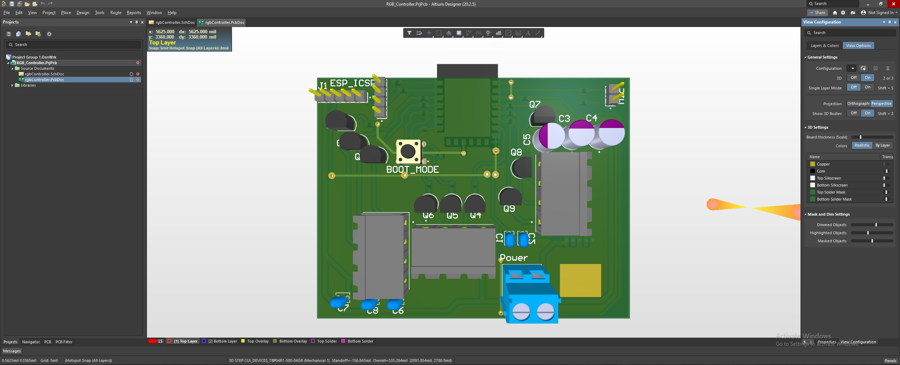

# 3 Channel RGB LED Strip Control with ESP8266 NodeMCU V2

## Project Overview
This project is a personal test project to control a 3 channel RGB LED strip using an ESP8266 NodeMCU V2. Each channel can be individually controlled via WiFi.

## Features
- **3 Channels:** Each channel controls a separate RGB LED strip.
- **ESP8266 NodeMCU V2:** Utilizes the NodeMCU V2 for WiFi control.
- **Control Pins:** Each channel has 3 data pins and one common anode.
- **WiFi Control:** The RGB LED strips can be controlled wirelessly via WiFi.

## Schematic

## PCB Layout
### 2D Front View

### 3D Back View

## 3D FRONT View

## How to Use
1. **Set up the ESP8266 NodeMCU V2:**
   - Flash the appropriate firmware.
   - Connect the RGB LED strips to the designated data pins and common anode.
2. **Connect to WiFi:**
   - Configure the WiFi settings on the ESP8266.
3. **Control the LED Strips:**
   - Use a web interface or a mobile app to control the LED strips via WiFi.

## Components Used
- ESP8266 NodeMCU V2
- RGB LED Strips
- Power Supply
- Connectors and Cables

## License
This project is licensed under the BSD 3-Clause License - see the [LICENSE](LICENSE) file for details.

## Author
- **Your Name**
  - GitHub: [burakkcmn](https://github.com/burakkcmn)
  - Email: [kocaman.burak.bk@gmail.com](mailto:kocaman.burak.bk@gmail.com)
